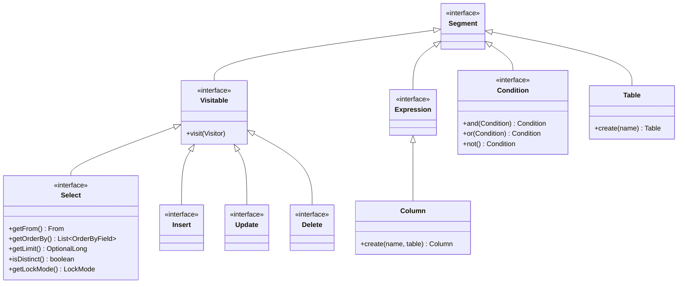
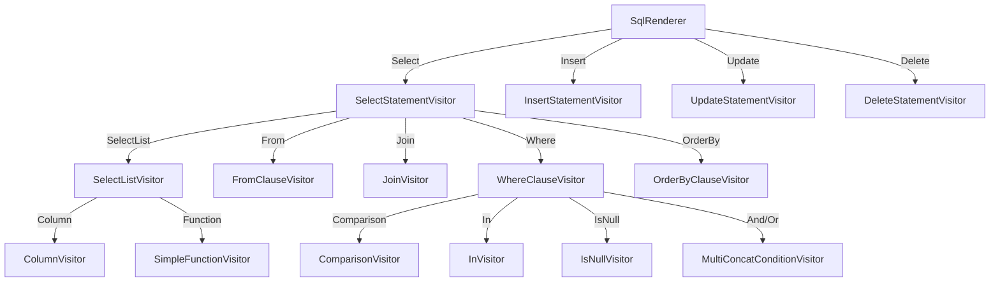

# SQL AST와 렌더링 엔진

Spring Data JDBC는 문자열 연결 대신 SQL Abstract Syntax Tree (AST)를 구성한 뒤 Visitor 패턴으로 SQL 문자열을 렌더링한다. 이 문서에서는 AST 구조, Builder 패턴으로의 생성, Visitor 패턴 기반 렌더링의 내부 동작을 분석한다.

## 목차
- [1. 핵심 개념 (What)](#1-핵심-개념-what)
- [2. 왜 알아야 하는가 (Why)](#2-왜-알아야-하는가-why)
- [3. 내부 구현 분석 (How)](#3-내부-구현-분석-how)
- [4. 실전 예제](#4-실전-예제)
- [5. 정리](#5-정리)

---

## 1. 핵심 개념 (What)

Spring Data Relational은 `org.springframework.data.relational.core.sql` 패키지에 SQL을 추상 구문 트리(AST)로 표현하는 자체 SQL 모델을 포함하고 있다. 이 모델은 약 80개 이상의 클래스로 구성되며, 다음 세 가지 핵심 설계 패턴을 사용한다:

1. **Immutable AST 노드**: `Segment` 인터페이스를 루트로 하는 불변 트리 구조
2. **Builder 패턴**: `StatementBuilder`를 통해 유창한(fluent) API로 AST를 생성
3. **Visitor 패턴**: `SqlRenderer`가 AST를 순회하며 SQL 문자열을 생성

### 패키지 구성

| 패키지 | 클래스 수 | 역할 |
|--------|-----------|------|
| `o.s.d.r.core.sql` | ~80개 | AST 노드 (Select, Insert, Table, Column, Condition 등) |
| `o.s.d.r.core.sql.render` | ~50개 | Visitor 기반 SQL 렌더링 |
| `o.s.d.r.core.dialect` | ~25개 | 데이터베이스별 렌더링 커스터마이징 |

## 2. 왜 알아야 하는가 (Why)

- **데이터베이스 독립성**: 동일한 AST를 서로 다른 Dialect의 렌더러로 처리하면 PostgreSQL, MySQL, SQL Server 등 다양한 데이터베이스용 SQL을 생성할 수 있다
- **타입 안전성**: 문자열 연결 대신 구조화된 트리를 사용하므로 SQL 인젝션 위험이 낮고 구문 오류를 컴파일 타임에 방지할 수 있다
- **확장성**: 커스텀 Visitor를 추가하여 SQL 로깅, 변환, 감사(audit) 등을 구현할 수 있다
- **프레임워크 내부 이해**: `SqlGenerator`가 왜 특정 SQL을 생성하는지, 예상과 다른 SQL이 나올 때 원인을 추적할 수 있다

## 3. 내부 구현 분석 (How)

### 3.1 AST 노드 계층 구조



### 3.2 Segment 인터페이스

모든 AST 노드의 루트 인터페이스는 `Segment`이다. `Visitable`을 확장하여 Visitor 패턴을 지원한다.

```
Segment (마커 인터페이스)
  └── Visitable (visit 메서드 제공)
        ├── Select / Insert / Update / Delete  (Statement 노드)
        ├── From, Join, Where, OrderBy         (절 노드)
        ├── Column, Table, AsteriskFromTable   (요소 노드)
        └── Condition 계열                      (조건 노드)
```

**Statement 노드들의 방문 순서** (Select 기준):
```java
// Select 인터페이스 Javadoc - 방문 순서:
// 1. Self (Select)
// 2. SELECT columns (Column/Expression)
// 3. FROM tables (Table)
// 4. JOINs
// 5. WHERE condition
// 6. ORDER BY fields
```

### 3.3 Builder 패턴으로 AST 생성

`StatementBuilder`는 각 Statement 타입에 대한 빌더를 제공한다.

**Select 빌더**:

```java
// StatementBuilder를 통한 Select 생성
Table orders = Table.create("orders");
Column id = Column.create("id", orders);
Column status = Column.create("status", orders);

Select select = Select.builder()
    .select(id, status)
    .from(orders)
    .where(Conditions.isEqual(status, SQL.literalOf("PENDING")))
    .orderBy(OrderByField.from(id).asc())
    .limit(10)
    .offset(0)
    .build();
```

빌더 내부적으로 `DefaultSelectBuilder`가 사용되며, `build()` 호출 시 `DefaultSelect` 인스턴스가 생성된다. `DefaultSelect`는 `SelectValidator`를 통해 유효성을 검증한 후 불변 객체를 반환한다.

**Insert 빌더**:

```java
Table users = Table.create("users");

Insert insert = Insert.builder()
    .into(users)
    .column(Column.create("name", users))
    .column(Column.create("email", users))
    .value(SQL.bindMarker(":name"))
    .value(SQL.bindMarker(":email"))
    .build();
```

**Delete 빌더**:

```java
Table orders = Table.create("orders");

Delete delete = StatementBuilder.delete()
    .from(orders)
    .where(Conditions.isEqual(
        Column.create("id", orders), SQL.bindMarker(":id")))
    .build();
```

### 3.4 주요 Condition 타입

| 클래스 | SQL 표현 | 설명 |
|--------|----------|------|
| `Comparison` | `col = :val` | 비교 연산 |
| `AndCondition` | `A AND B` | AND 결합 |
| `OrCondition` | `A OR B` | OR 결합 |
| `In` | `col IN (:vals)` | IN 절 |
| `IsNull` | `col IS NULL` | NULL 체크 |
| `Like` | `col LIKE :pattern` | LIKE 매칭 |
| `Between` | `col BETWEEN :a AND :b` | 범위 조건 |
| `Not` | `NOT (condition)` | 부정 |
| `NestedCondition` | `(condition)` | 괄호 그룹 |
| `TrueCondition` | 항상 참 | 기본 조건 |

### 3.5 Visitor 패턴과 렌더링 엔진

렌더링의 핵심은 **DelegatingVisitor** 패턴이다. 각 Visitor가 자신이 처리할 수 있는 AST 노드를 만나면 처리하고, 다른 노드는 하위 Visitor에게 위임한다.



### 3.6 DelegatingVisitor의 위임 메커니즘

`DelegatingVisitor`는 Stack 기반으로 위임 체인을 관리한다.

```java
// DelegatingVisitor 핵심 구조
abstract class DelegatingVisitor implements Visitor {
    private final Stack<DelegatingVisitor> delegation = new Stack<>();

    // enter: AST 노드에 진입할 때
    public final void enter(Visitable segment) {
        if (delegation.isEmpty()) {
            Delegation visitor = doEnter(segment);  // 하위 클래스에서 구현
            if (visitor.isDelegate()) {
                delegation.push(visitor.getDelegate());
                visitor.getDelegate().enter(segment);
            }
        } else {
            delegation.peek().enter(segment);  // 현재 위임 대상에게 전달
        }
    }

    // leave: AST 노드에서 빠져나올 때
    public final void leave(Visitable segment) {
        // 위임 해제 로직
    }
}
```

**Delegation 값 객체**:
- `Delegation.retain()`: 현재 Visitor가 계속 처리
- `Delegation.leave()`: 현재 Visitor의 처리 완료, 부모로 복귀
- `Delegation.delegateTo(visitor)`: 하위 Visitor에게 위임

### 3.7 SelectStatementVisitor의 렌더링 과정

```java
// SelectStatementVisitor.doEnter() - 68행
public Delegation doEnter(Visitable segment) {
    if (segment instanceof SelectList) {
        return Delegation.delegateTo(selectListVisitor);   // SELECT 절 위임
    }
    if (segment instanceof OrderByField) {
        return Delegation.delegateTo(orderByClauseVisitor); // ORDER BY 위임
    }
    if (segment instanceof From) {
        return Delegation.delegateTo(fromClauseVisitor);   // FROM 절 위임
    }
    if (segment instanceof Join) {
        return Delegation.delegateTo(new JoinVisitor(...)); // JOIN 위임
    }
    if (segment instanceof Where) {
        return Delegation.delegateTo(whereClauseVisitor);  // WHERE 위임
    }
    return Delegation.retain();
}

// doLeave에서 최종 조합 - 102행
public Delegation doLeave(Visitable segment) {
    if (segment instanceof Select select) {
        builder.append("SELECT ");
        if (select.isDistinct()) builder.append("DISTINCT ");
        builder.append(selectList);                                      // 컬럼 목록
        builder.append(selectRenderContext.afterSelectList().apply(select));
        if (!from.isEmpty()) builder.append(" FROM ").append(from);      // FROM
        builder.append(selectRenderContext.afterFromTable().apply(select));
        if (!join.isEmpty()) builder.append(' ').append(join);           // JOIN
        if (!where.isEmpty()) builder.append(" WHERE ").append(where);   // WHERE
        if (!orderBy.isEmpty()) builder.append(" ORDER BY ").append(orderBy);
        builder.append(selectRenderContext.afterOrderBy(...).apply(select)); // LIMIT 등
        return Delegation.leave();
    }
    return Delegation.retain();
}
```

### 3.8 SqlRenderer 진입점

`SqlRenderer`는 Statement 타입에 따라 적절한 최상위 Visitor를 생성하고 렌더링을 시작한다.

```java
// SqlRenderer.render(Select) - 108행
public String render(Select select) {
    SelectStatementVisitor visitor = new SelectStatementVisitor(context);
    select.visit(visitor);     // AST 순회 시작
    return visitor.getRenderedPart().toString();
}

// SqlRenderer.render(Delete) - 148행
public String render(Delete delete) {
    DeleteStatementVisitor visitor = new DeleteStatementVisitor(context);
    delete.visit(visitor);
    return visitor.getRenderedPart().toString();
}
```

### 3.9 RenderContext와 Dialect 연동

`RenderContext`는 렌더링 시 필요한 컨텍스트 정보를 제공한다:

```java
// RenderContext 인터페이스
public interface RenderContext {
    RenderNamingStrategy getNamingStrategy();      // 이름 변환 전략
    IdentifierProcessing getIdentifierProcessing(); // 식별자 처리 (인용, 케이싱)
    SelectRenderContext getSelectRenderContext();    // SELECT 특화 컨텍스트
    InsertRenderContext getInsertRenderContext();    // INSERT 특화 컨텍스트
}
```

`SelectRenderContext`는 Dialect가 SQL의 특정 위치에 내용을 삽입할 수 있게 해준다:
- `afterSelectList()`: SELECT 절 뒤 (SQL Server의 TOP N)
- `afterFromTable()`: FROM 절 뒤 (SQL Server의 WITH 힌트)
- `afterOrderBy()`: ORDER BY 뒤 (LIMIT/OFFSET, LOCK 절)

## 4. 실전 예제

### 4.1 SQL AST를 직접 구성하고 렌더링

```java
import org.springframework.data.relational.core.sql.*;
import org.springframework.data.relational.core.sql.render.SqlRenderer;

// 1. 테이블과 컬럼 정의
Table users = Table.create("users");
Column id = Column.create("id", users);
Column name = Column.create("name", users);
Column email = Column.create("email", users);

// 2. Select AST 구성
Select select = Select.builder()
    .select(id, name, email)
    .from(users)
    .where(Conditions.isEqual(name, SQL.bindMarker(":name")))
    .orderBy(OrderByField.from(id).asc())
    .limit(10)
    .build();

// 3. SQL 렌더링
String sql = SqlRenderer.toString(select);
// 결과: SELECT users.id, users.name, users.email
//        FROM users
//        WHERE users.name = :name
//        ORDER BY users.id ASC
//        LIMIT 10
```

### 4.2 JOIN이 포함된 복합 쿼리

```java
Table orders = Table.create("orders");
Table items = Table.create("order_items");

Column orderId = Column.create("id", orders);
Column orderStatus = Column.create("status", orders);
Column itemOrderId = Column.create("order_id", items);
Column productName = Column.create("product_name", items);

Select select = Select.builder()
    .select(orderId, orderStatus, productName)
    .from(orders)
    .join(items).on(Conditions.isEqual(orderId, itemOrderId))
    .where(Conditions.isEqual(orderStatus, SQL.literalOf("ACTIVE")))
    .build();

String sql = SqlRenderer.toString(select);
// 결과: SELECT orders.id, orders.status, order_items.product_name
//        FROM orders
//        JOIN order_items ON orders.id = order_items.order_id
//        WHERE orders.status = 'ACTIVE'
```

### 4.3 Dialect별 렌더링 차이

```java
import org.springframework.data.relational.core.dialect.*;
import org.springframework.data.relational.core.sql.render.*;

Table users = Table.create("users");
Column id = Column.create("id", users);

Select select = Select.builder()
    .select(id)
    .from(users)
    .limit(10)
    .offset(20)
    .build();

// PostgreSQL: LIMIT 10 OFFSET 20
RenderContextFactory pgFactory = new RenderContextFactory(new PostgresDialect());
String pgSql = SqlRenderer.create(pgFactory.createRenderContext()).render(select);

// SQL Server: OFFSET 20 ROWS FETCH NEXT 10 ROWS ONLY
RenderContextFactory ssFactory = new RenderContextFactory(new SqlServerDialect());
String ssSql = SqlRenderer.create(ssFactory.createRenderContext()).render(select);

// MySQL: LIMIT 20, 10
RenderContextFactory myFactory = new RenderContextFactory(new MySqlDialect());
String mySql = SqlRenderer.create(myFactory.createRenderContext()).render(select);
```

### 4.4 조건 조합

```java
Table users = Table.create("users");
Column age = Column.create("age", users);
Column status = Column.create("status", users);
Column name = Column.create("name", users);

// 복합 조건: (age >= 18 AND status = 'ACTIVE') OR name LIKE '%admin%'
Condition condition = Conditions.isGreaterOrEqualTo(age, SQL.literalOf(18))
    .and(Conditions.isEqual(status, SQL.literalOf("ACTIVE")))
    .or(Conditions.like(name, SQL.literalOf("%admin%")));

Select select = Select.builder()
    .select(Column.create("*", users))
    .from(users)
    .where(condition)
    .build();
```

## 5. 정리

| 항목 | 설명 |
|------|------|
| AST 루트 | `Segment` -> `Visitable` 인터페이스 |
| Statement 타입 | `Select`, `Insert`, `Update`, `Delete` |
| 생성 방법 | Builder 패턴 (`Select.builder()`, `StatementBuilder.delete()`) |
| 렌더링 방법 | Visitor 패턴 (`SqlRenderer` -> `XxxStatementVisitor`) |
| 위임 메커니즘 | `DelegatingVisitor` Stack 기반 위임 체인 |
| Dialect 연동 | `RenderContext` -> `SelectRenderContext`로 LIMIT/LOCK 위치 결정 |
| Visitor 수 | `render` 패키지에 약 50개의 전용 Visitor 클래스 |
| 검증 | `SelectValidator`, `DeleteValidator` 등으로 AST 유효성 검증 |

**AST -> SQL 변환 파이프라인**:

```
Builder API
  -> DefaultSelect / DefaultInsert / DefaultUpdate / DefaultDelete (불변 AST)
    -> Validator (구조 검증)
      -> SqlRenderer.render()
        -> XxxStatementVisitor (최상위)
          -> ClauseVisitor (절 단위 위임)
            -> ConditionVisitor / ColumnVisitor (요소 단위 위임)
              -> SQL 문자열 조합
```

---
*참고: Spring Data JDBC 3.x / Spring Boot 3.x 기준*
