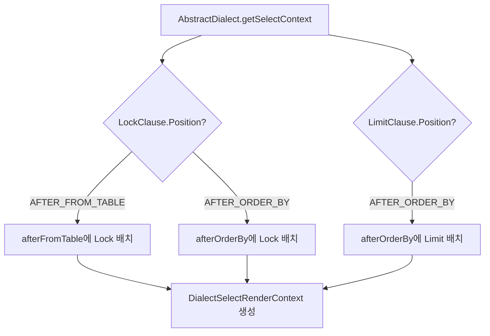
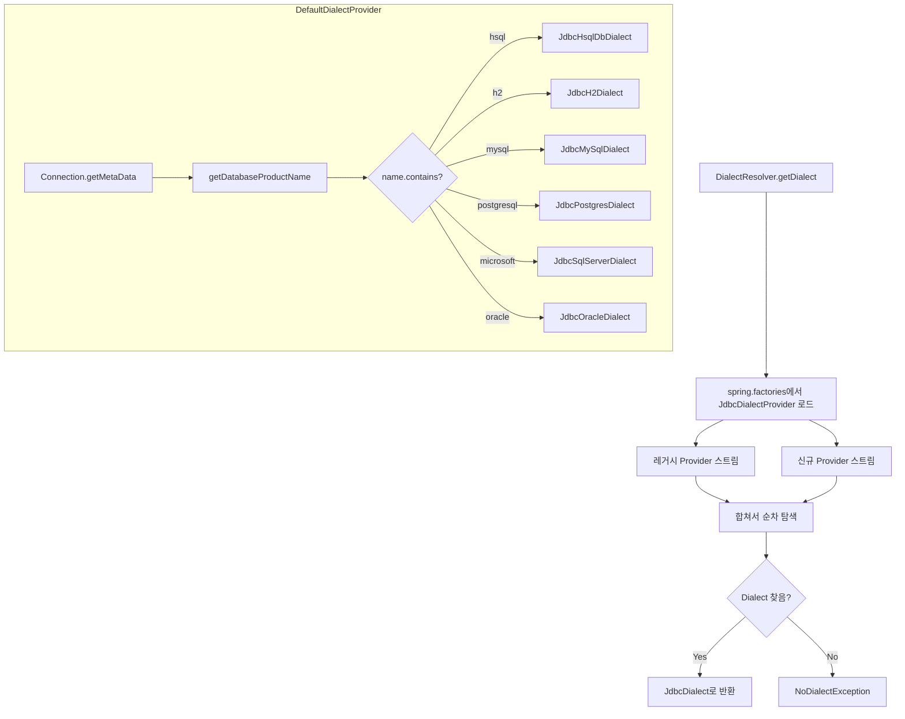

# Dialect 시스템과 데이터베이스 추상화

Spring Data JDBC의 Dialect 시스템은 서로 다른 데이터베이스의 SQL 문법 차이를 추상화한다. 이 문서에서는 Dialect 인터페이스의 설계, 8개 구현체의 특성, 그리고 자동 감지 메커니즘을 소스코드 기반으로 분석한다.

## 목차
- [1. 핵심 개념 (What)](#1-핵심-개념-what)
- [2. 왜 알아야 하는가 (Why)](#2-왜-알아야-하는가-why)
- [3. 내부 구현 분석 (How)](#3-내부-구현-분석-how)
- [4. 실전 예제](#4-실전-예제)
- [5. 정리](#5-정리)

---

## 1. 핵심 개념 (What)

`Dialect`는 특정 데이터베이스 제품의 SQL 문법 특성을 정의하는 인터페이스다. LIMIT/OFFSET 구문, 락 절, 배열 타입 지원, 식별자 처리(인용 문자, 대소문자) 등 데이터베이스마다 다른 부분을 추상화한다.

### Dialect 계층 구조

```
Dialect (인터페이스)
  └── AbstractDialect (추상 클래스 - SelectRenderContext 생성)
        ├── H2Dialect
        ├── PostgresDialect
        ├── MySqlDialect
        │     └── MariaDbDialect
        ├── SqlServerDialect
        ├── Db2Dialect
        ├── AnsiDialect
        │     ├── OracleDialect
        │     └── HsqlDbDialect
```

JDBC 모듈에서는 각 Dialect에 대응하는 `JdbcXxxDialect` 래퍼가 존재하며, `JdbcArrayColumns` 같은 JDBC 전용 확장을 추가한다.

## 2. 왜 알아야 하는가 (Why)

- **데이터베이스 이식성**: 같은 코드가 PostgreSQL에서 MySQL로 전환될 때 SQL이 어떻게 달라지는지 이해해야 한다
- **커스텀 Dialect**: 지원되지 않는 데이터베이스를 사용하거나 기존 Dialect를 커스터마이징할 때 필수 지식이다
- **자동 감지 실패 대응**: `DialectResolver`가 데이터베이스를 감지하지 못할 때 수동 설정 방법을 알아야 한다
- **기능 제약 이해**: 특정 데이터베이스에서 `ArrayColumns`이나 `Single Query Loading`이 지원되지 않는 이유를 파악할 수 있다

## 3. 내부 구현 분석 (How)

### 3.1 Dialect 인터페이스의 메서드

```java
// Dialect 인터페이스 - 핵심 메서드
public interface Dialect {
    LimitClause limit();                     // LIMIT/OFFSET 구문
    LockClause lock();                       // FOR UPDATE / WITH 힌트
    ArrayColumns getArraySupport();          // 배열 컬럼 지원 여부
    SelectRenderContext getSelectContext();   // SELECT 렌더링 컨텍스트
    IdentifierProcessing getIdentifierProcessing(); // 식별자 인용/케이싱
    Escaper getLikeEscaper();                // LIKE 이스케이핑
    IdGeneration getIdGeneration();          // ID 생성 전략
    Collection<Object> getConverters();      // 타입 변환기
    Set<Class<?>> simpleTypes();             // 네이티브 타입
    InsertRenderContext getInsertRenderContext(); // INSERT 렌더링 컨텍스트
    OrderByNullPrecedence orderByNullHandling(); // NULL 정렬 순서
    SimpleFunction getExistsFunction();      // EXISTS 쿼리 함수
    boolean supportsSingleQueryLoading();    // Single Query Loading 지원
}
```

### 3.2 LimitClause - 페이징 구문

```java
public interface LimitClause {
    String getLimit(long limit);            // LIMIT만
    String getOffset(long offset);          // OFFSET만
    String getLimitOffset(long limit, long offset); // 둘 다
    Position getClausePosition();           // 절 위치
}
```

**데이터베이스별 LimitClause 비교**:

| DB | LIMIT | OFFSET | LIMIT+OFFSET |
|----|-------|--------|--------------|
| PostgreSQL | `LIMIT 10` | `OFFSET 20` | `LIMIT 10 OFFSET 20` |
| MySQL | `LIMIT 10` | `LIMIT 20, 18446744073709551615` | `LIMIT 20, 10` |
| SQL Server | `OFFSET 0 ROWS FETCH NEXT 10 ROWS ONLY` | `OFFSET 20 ROWS` | `OFFSET 20 ROWS FETCH NEXT 10 ROWS ONLY` |
| H2 | `LIMIT 10` | `OFFSET 20` | `OFFSET 20 ROWS FETCH FIRST 10 ROWS ONLY` |
| Oracle (ANSI) | `FETCH FIRST 10 ROWS ONLY` | `OFFSET 20 ROWS` | `OFFSET 20 ROWS FETCH FIRST 10 ROWS ONLY` |

### 3.3 LockClause - 잠금 구문

```java
public interface LockClause {
    String getLock(LockOptions lockOptions);
    Position getClausePosition();  // AFTER_FROM_TABLE 또는 AFTER_ORDER_BY
}
```

**데이터베이스별 LockClause 비교**:

| DB | PESSIMISTIC_WRITE | PESSIMISTIC_READ | 위치 |
|----|-------------------|------------------|------|
| PostgreSQL | `FOR UPDATE OF "table"` | `FOR SHARE OF "table"` | AFTER_ORDER_BY |
| MySQL | `FOR UPDATE` | `LOCK IN SHARE MODE` | AFTER_ORDER_BY |
| SQL Server | `WITH (UPDLOCK, ROWLOCK)` | `WITH (HOLDLOCK, ROWLOCK)` | AFTER_FROM_TABLE |
| H2/ANSI | `FOR UPDATE` | `FOR UPDATE` | AFTER_ORDER_BY |

SQL Server의 Lock 절은 FROM 테이블 바로 뒤에 위치하는 것이 특징이다:
```sql
-- SQL Server
SELECT * FROM users WITH (UPDLOCK, ROWLOCK) WHERE id = 1

-- PostgreSQL
SELECT * FROM users WHERE id = 1 FOR UPDATE OF "users"
```

### 3.4 ArrayColumns - 배열 타입 지원

```java
public interface ArrayColumns {
    boolean isSupported();
    Class<?> getArrayType(Class<?> userType);

    enum Unsupported implements ArrayColumns {
        INSTANCE;  // 배열 미지원 DB용 기본 구현
    }
}
```

| DB | 배열 지원 | 구현 클래스 |
|----|-----------|------------|
| PostgreSQL | O | `ObjectArrayColumns` |
| H2 | O | `H2ArrayColumns` |
| MySQL | X | `ArrayColumns.Unsupported` |
| SQL Server | X | `ArrayColumns.Unsupported` |
| Oracle | X | `ArrayColumns.Unsupported` |

### 3.5 IdentifierProcessing - 식별자 처리

```java
public interface IdentifierProcessing {
    String quote(String identifier);           // 인용 처리
    LetterCasing getLetterCasing();            // 대소문자 처리
    IdentifierProcessing ANSI = create(Quoting.ANSI, LetterCasing.UPPER_CASE);
}
```

| DB | 인용 문자 | 기본 케이싱 |
|----|-----------|------------|
| PostgreSQL | `"` (ANSI) | LOWER_CASE |
| MySQL | `` ` `` (백틱) | LOWER_CASE |
| SQL Server | `"` (ANSI) | AS_IS |
| H2 | `"` (ANSI) | UPPER_CASE |
| Oracle | `"` (ANSI) | UPPER_CASE |

### 3.6 AbstractDialect - SelectRenderContext 생성

`AbstractDialect`는 `Dialect`의 `LimitClause`와 `LockClause` 설정을 기반으로 `SelectRenderContext`를 자동 생성한다.



```java
// AbstractDialect.getSelectContext() - 38행
public SelectRenderContext getSelectContext() {
    Function<Select, ? extends CharSequence> afterFromTable = getAfterFromTable();
    Function<Select, ? extends CharSequence> afterOrderBy = getAfterOrderBy();
    return new DialectSelectRenderContext(afterFromTable, afterOrderBy, orderByNullHandling());
}
```

이 구조 덕분에 SQL Server의 `WITH` 힌트가 FROM 뒤에, PostgreSQL의 `FOR UPDATE`가 쿼리 끝에 자동 배치된다.

### 3.7 각 Dialect 구현체의 특징

#### PostgresDialect

```java
public class PostgresDialect extends AbstractDialect {
    // 특이사항:
    // - UUID, URL, URI, InetAddress, Map을 simpleTypes로 등록
    // - FOR UPDATE/SHARE에 테이블명 명시: "FOR UPDATE OF tablename"
    // - EXISTS 함수로 LEAST(COUNT(1), 1) 사용 (표준 COUNT(1) 대신)
    // - TimestampAtUtcToOffsetDateTimeConverter 제공
    // - IdentifierProcessing: ANSI 인용, LOWER_CASE
}
```

#### MySqlDialect

```java
public class MySqlDialect extends AbstractDialect {
    // 특이사항:
    // - OFFSET만 사용 시 워크어라운드: LIMIT offset, 18446744073709551615
    // - LOCK IN SHARE MODE (MySQL 5.x 호환)
    // - NumberToBooleanConverter, TimestampAtUtcToOffsetDateTimeConverter
    // - 백틱(`) 인용 문자
    // - OrderByNullPrecedence.NONE (NULLS FIRST/LAST 미지원)
    // - 시퀀스 미지원
}
```

#### SqlServerDialect

```java
public class SqlServerDialect extends AbstractDialect {
    // 특이사항:
    // - LIMIT: OFFSET/FETCH 구문 사용
    // - Lock이 FROM 테이블 뒤에 위치: WITH (UPDLOCK, ROWLOCK)
    // - SqlServerSelectRenderContext 별도 사용 (TOP N 지원)
    // - LIKE 이스케이핑에 [ ] 추가 처리
    // - InsertRenderContext: MS SQL Server 전용
    // - 배치 ID 생성 미지원: supportedForBatchOperations() = false
    // - ANSI 인용, AS_IS 케이싱
}
```

#### H2Dialect

```java
public class H2Dialect extends AbstractDialect {
    // 특이사항:
    // - LIMIT+OFFSET: OFFSET x ROWS FETCH FIRST y ROWS ONLY (SQL:2008)
    // - H2ArrayColumns: 배열 지원 (primitive 타입 자동 래핑)
    // - Single Query Loading 미지원: supportsSingleQueryLoading() = false
    // - ANSI 인용, UPPER_CASE
}
```

#### OracleDialect

```java
public class OracleDialect extends AnsiDialect {
    // 특이사항:
    // - AnsiDialect 상속 (ANSI 표준 LIMIT/LOCK)
    // - 드라이버가 KEY_COLUMN_NAMES 필요: driverRequiresKeyColumnNames() = true
    // - BooleanToIntegerConverter: Boolean -> 0/1 변환
    // - 시퀀스 쿼리: SELECT seq.nextval FROM DUAL
}
```

### 3.8 DialectResolver - 자동 감지 메커니즘

`DialectResolver`는 `SpringFactoriesLoader`와 JDBC `DatabaseMetaData`를 사용하여 적절한 Dialect를 자동으로 감지한다.

```java
// DialectResolver.getDialect() - 83행
public static JdbcDialect getDialect(JdbcOperations operations) {
    return Stream.concat(LEGACY_DETECTORS.stream(), DETECTORS.stream())
        .map(it -> it.getDialect(operations))
        .flatMap(Optionals::toStream)
        .map(it -> it instanceof JdbcDialect jd ? jd : new JdbcDialectAdapter(it))
        .findFirst()
        .orElseThrow(() -> new NoDialectException(...));
}
```

**DefaultDialectProvider의 감지 로직**:

```java
// DefaultDialectProvider.getDialect(Connection) - 121행
private static JdbcDialect getDialect(Connection connection) throws SQLException {
    DatabaseMetaData metaData = connection.getMetaData();
    String name = metaData.getDatabaseProductName().toLowerCase(Locale.ENGLISH);

    if (name.contains("hsql"))       return JdbcHsqlDbDialect.INSTANCE;
    if (name.contains("h2"))         return JdbcH2Dialect.INSTANCE;
    if (name.contains("mysql"))      return new JdbcMySqlDialect(getIdentifierProcessing(metaData));
    if (name.contains("mariadb"))    return new JdbcMariaDbDialect(getIdentifierProcessing(metaData));
    if (name.contains("postgresql")) return JdbcPostgresDialect.INSTANCE;
    if (name.contains("microsoft"))  return JdbcSqlServerDialect.INSTANCE;
    if (name.contains("db2"))        return JdbcDb2Dialect.INSTANCE;
    if (name.contains("oracle"))     return JdbcOracleDialect.INSTANCE;

    return null;  // 감지 실패
}
```

**감지 순서와 SPI 확장**:



MySQL과 MariaDB의 경우 `DatabaseMetaData`에서 `IdentifierProcessing`을 동적으로 구성한다:

```java
// DefaultDialectProvider.getIdentifierProcessing() - 156행
private static IdentifierProcessing getIdentifierProcessing(DatabaseMetaData metaData) {
    String quoteString = metaData.getIdentifierQuoteString();
    Quoting quoting = StringUtils.hasText(quoteString)
        ? new Quoting(quoteString) : Quoting.NONE;

    LetterCasing letterCasing;
    if (metaData.supportsMixedCaseIdentifiers()) {
        letterCasing = LetterCasing.AS_IS;
    } else if (metaData.storesUpperCaseIdentifiers()) {
        letterCasing = LetterCasing.UPPER_CASE;
    } else if (metaData.storesLowerCaseIdentifiers()) {
        letterCasing = LetterCasing.LOWER_CASE;
    } else {
        letterCasing = LetterCasing.UPPER_CASE; // ANSI 기본값
    }
    return IdentifierProcessing.create(quoting, letterCasing);
}
```

## 4. 실전 예제

### 4.1 커스텀 Dialect 등록 (spring.factories)

지원되지 않는 데이터베이스 또는 기존 Dialect를 수정해야 할 경우:

```java
// 커스텀 Dialect 정의
public class CockroachDbDialect extends PostgresDialect {

    public static final CockroachDbDialect INSTANCE = new CockroachDbDialect();

    @Override
    public boolean supportsSingleQueryLoading() {
        return false; // CockroachDB에서 복잡한 JOIN 비활성화
    }

    @Override
    public OrderByNullPrecedence orderByNullHandling() {
        return OrderByNullPrecedence.NONE;
    }
}

// JdbcDialectProvider 구현
public class CockroachDbDialectProvider implements DialectResolver.JdbcDialectProvider {

    @Override
    public Optional<Dialect> getDialect(JdbcOperations operations) {
        return Optional.ofNullable(
            operations.execute((ConnectionCallback<Dialect>) connection -> {
                String productName = connection.getMetaData()
                    .getDatabaseProductName().toLowerCase();
                if (productName.contains("cockroach")) {
                    return CockroachDbDialect.INSTANCE;
                }
                return null;
            })
        );
    }
}
```

`META-INF/spring.factories`에 등록:
```properties
org.springframework.data.jdbc.core.dialect.DialectResolver$JdbcDialectProvider=\
  com.example.CockroachDbDialectProvider
```

### 4.2 수동 Dialect 설정

자동 감지가 실패할 때 직접 Bean으로 등록:

```java
@Configuration
public class JdbcConfig extends AbstractJdbcConfiguration {

    @Bean
    public Dialect jdbcDialect() {
        return PostgresDialect.INSTANCE;
    }
}
```

### 4.3 Dialect 기능별 조건부 로직

```java
@Service
public class DataService {

    private final Dialect dialect;
    private final JdbcAggregateOperations operations;

    public <T> List<T> findWithArraySupport(Query query, Class<T> type) {
        if (dialect.getArraySupport().isSupported()) {
            // PostgreSQL/H2: 배열 파라미터를 직접 사용
            return operations.findAll(
                query.withCriteria(Criteria.where("tags").in(arrayParam)),
                type
            );
        } else {
            // MySQL/SQL Server: 개별 조건으로 대체
            return operations.findAll(
                query.withCriteria(buildIndividualCriteria(tags)),
                type
            );
        }
    }
}
```

### 4.4 IdentifierProcessing 활용

```java
// PostgreSQL: "user_name" (소문자 + ANSI 인용)
// MySQL: `user_name` (소문자 + 백틱)
// H2: "USER_NAME" (대문자 + ANSI 인용)
// SQL Server: "user_name" (원문 유지 + ANSI 인용)

SqlIdentifier columnName = SqlIdentifier.quoted("user_name");

// Dialect별로 다른 결과
String pgSql = columnName.toSql(PostgresDialect.INSTANCE.getIdentifierProcessing());
// -> "user_name"

String h2Sql = columnName.toSql(H2Dialect.INSTANCE.getIdentifierProcessing());
// -> "USER_NAME"
```

## 5. 정리

| Dialect | LimitClause | LockClause 위치 | Array | SingleQuery | 식별자 케이싱 |
|---------|-------------|-----------------|-------|-------------|--------------|
| PostgreSQL | `LIMIT/OFFSET` | AFTER_ORDER_BY | O | O | LOWER_CASE |
| MySQL | `LIMIT offset, count` | AFTER_ORDER_BY | X | O | LOWER_CASE |
| MariaDB | MySQL과 동일 | AFTER_ORDER_BY | X | O | LOWER_CASE |
| SQL Server | `OFFSET/FETCH` | AFTER_FROM_TABLE | X | O | AS_IS |
| H2 | `OFFSET ROWS/FETCH` | AFTER_ORDER_BY | O | X | UPPER_CASE |
| Oracle | ANSI 표준 | AFTER_ORDER_BY | X | O | UPPER_CASE |
| Db2 | ANSI 표준 | AFTER_ORDER_BY | X | O | UPPER_CASE |
| HsqlDb | ANSI 표준 | AFTER_ORDER_BY | X | O | UPPER_CASE |

**핵심 구조 요약**:

| 구성 요소 | 역할 |
|-----------|------|
| `Dialect` 인터페이스 | DB별 SQL 문법 차이를 추상화하는 계약 |
| `AbstractDialect` | `SelectRenderContext` 자동 생성 (Limit/Lock 위치 처리) |
| `LimitClause` / `LockClause` | 페이징/잠금 구문의 DB별 구현 |
| `IdentifierProcessing` | 식별자 인용 문자와 대소문자 변환 |
| `ArrayColumns` | 배열 컬럼 지원 여부와 타입 매핑 |
| `DialectResolver` | `DatabaseMetaData`를 사용한 Dialect 자동 감지 |
| `JdbcDialectProvider` SPI | `spring.factories`를 통한 커스텀 Dialect 확장 포인트 |

---
*참고: Spring Data JDBC 3.x / Spring Boot 3.x 기준*
